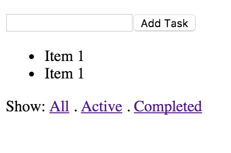

# Phần 1: Bắt đầu từ Mock Up

Tôi tạo một mockup bằng React để hình dung mọi thứ rõ ràng hơn

```
const AddTodo = ({onSubmit, onClick, children}) => {
  
  return (
    <form onSubmit={onSubmit}>
      <input type="text"/>
      <button type="button" onClick={onClick}>
        {children}
      </button>
    </form>
  );
}
 
const TodoList = () => {
  
  return (
    <ul>
      <li>Item 1</li>
      <li>Item 1</li>
    </ul>
  )
}

const Links = (props) => {
  
    return (
      <div>
        Show: 
        {"  "}
        <a href="#">All</a>
        {" . "}
        <a href="#">Active</a>
        {" . "}
        <a href="#">Completed</a>
      </div>
    )
}

class App extends React.Component {
  
  render() {
    return (
      <div>
        <AddTodo>
          Add Task
        </AddTodo>
        <TodoList/>
        <Links/>
      </div>
    );
  }

}

ReactDOM.render(
  <App/>,
  document.getElementById('app')
);
```
Kết quả:



