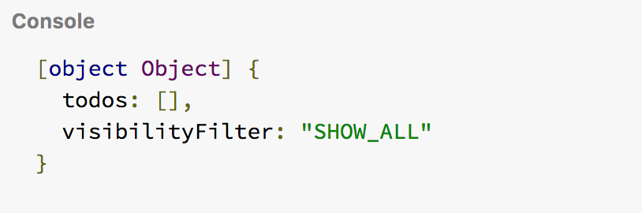
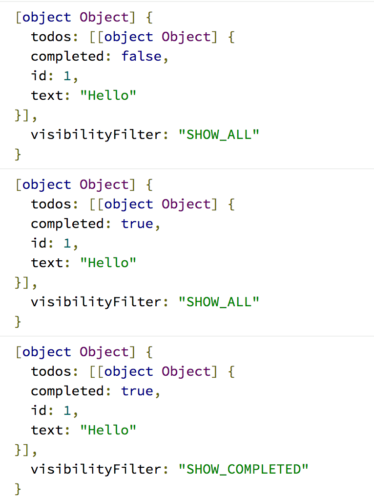

# Phần 4: Kết hợp với React

Chắc từ đầu tới giờ bạn sẽ hỏi liên tục, làm sao để kết hợp một mớ action & action reducer trong store với React?
Làm sao React có thể sử dụng các state của Redux?

Ok thôi test cái đã, ở phần trước tôi có nói đến các phương thức của store, giờ thử xem nó in lên console ra sao nhé.

```js
console.log(store.getState());

```

Kết quả, getState từ store khi chưa dispatch bất kỳ action nào.




Thử dispatch các action và getState xem sao

```js
store.dispatch({
  type: 'ADD_TODO',
  id: 1,
  text: 'Hello'
})
console.log(store.getState());

store.dispatch({
  type: 'TOGGLE_TODO',
  id: 1,

})
console.log(store.getState());

store.dispatch({
  type: 'SET_VISIBILITY_FILTER',
  filter: 'SHOW_COMPLETED'
})
console.log(store.getState());

```

Bạn có thể thấy các state thay đổi sau mỗi lần dispatch bất kỳ một action type nào đó




Mọi thứ đã êm xuôi, giờ quay lại các component của React.
Việc cần làm là đưa các action vào trong mockup component mà ta đã tạo

```js 
let nextTodoId = 0; // Khởi tạo id ban đầu
class App extends React.Component {
  render() {
    return (
      <div>
        <form>
          <input type="text"/>
          // Dispatch một action khi click nút 
          <button 
           onClick={() => {
            store.dispatch({
              type: 'ADD_TODO',
              id: nextTodoId++,
              text: 'hello'
            })
           }}
          >  
            Add Task
          </button>
        </form> 
        <ul>
          // nội dung list sẽ được map từ todos
          {this.props.todos.map(todo => 
             <li key={todo.key}>
              {todo.text}
             </li>
          )}
        </ul>
        <div>
          Show: 
          {"  "}
          <a href="#">All</a>
          {" . "}
          <a href="#">Active</a>
          {" . "}
          <a href="#">Completed</a>
        </div>
      </div>
    );
  }
}
```

Sau đó, ta đưa todos (coi nó là một props của App) vào trong render và *getState* sau mỗi thay đổi 

```js
const render = () => {
  ReactDOM.render(
    <App 
      todos={store.getState().todos}
    />,
    document.getElementById('app')
  );   
}
```

Ok giờ bạn thử Click vào nút xem chuyện gì xảy ra, 'hello' xuất hiện trong danh sách sau mỗi lần click.
Dispatch cái gì thì ra cái đó thôi. 
Giờ lấy nội dung từ trong input ra. Sửa code lại như sau:

```js 
...
<form>
  <input 
    type="text" 
    ref={node => {this.todoTaskCompose = node}} // dùng ref để lấy input này - xem thêm ref trong react
  /> 
  <button 
   onClick={e => {
    e.preventDefault() // thêm hàm này cho khỏi bị reload default submit
    store.dispatch({
      type: 'ADD_TODO',
      id: nextTodoId++,
      text: this.todoTaskCompose.value, // lấy giá trị từ input
    })
    this.todoTaskCompose.value = "" //giá trị khởi tạo
   }}
  >
    Add Task
  </button>
</form>
...
````

Vậy là ta có thể tạo task todo bằng cách gõ vào input và submit bằng button 

**Note** bạn có thể dùng cách khác là bỏ `onClick` trong cái button và thay vào đó là `onSubmit` trên `<form>` , đổi type của button thành `type="submit"`


